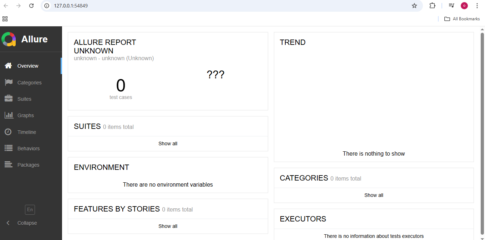
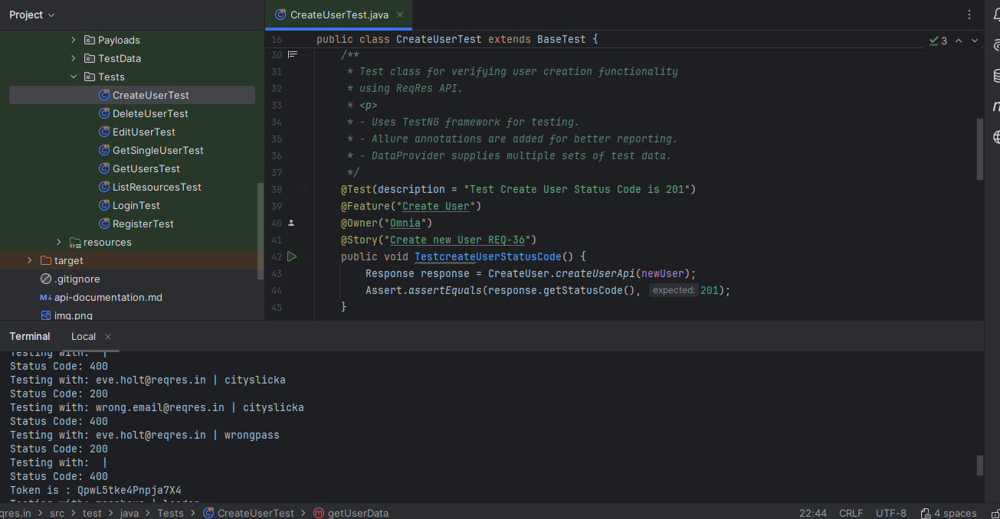
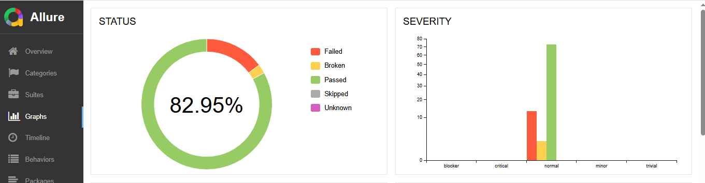
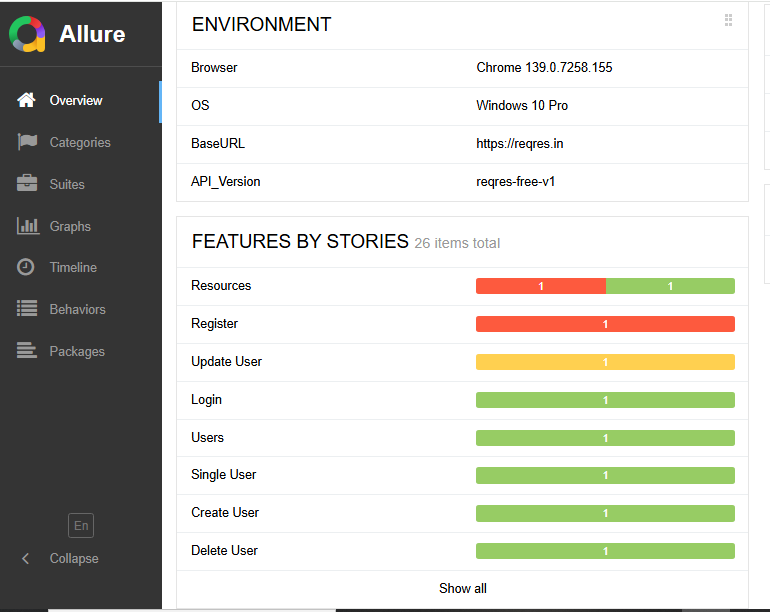
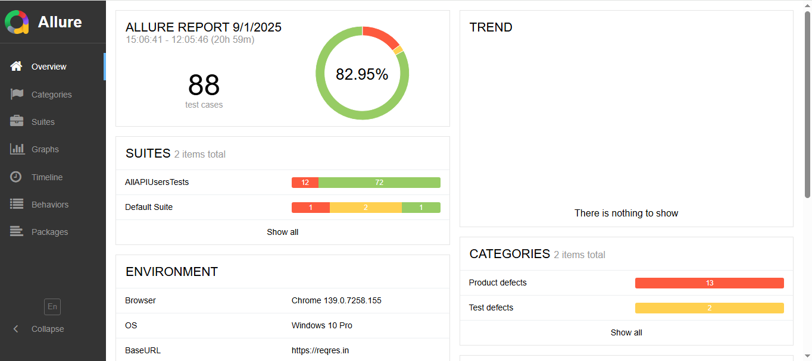
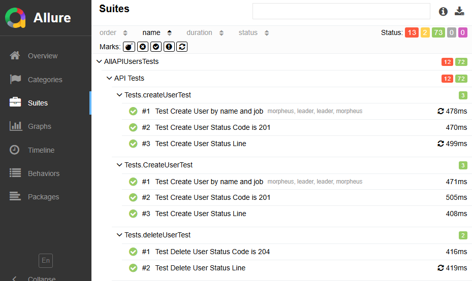

# 🚀 ReqRes API Testing Framework

This project is a **REST API test automation framework** built using **Java, RestAssured, TestNG, and Allure Reports
**.  
It is designed to test the [ReqRes API](https://reqres.in/), a free hosted REST API for testing and prototyping.

---

## 📌 Features

- Automated tests for key API endpoints:
    - Create User
    - Edit User
    - Delete User
    - Get Single User
    - Get Users
    - List Resources
    - Login
    - Register
- Data-driven testing using **TestNG DataProviders**.
- Centralized test data and payloads.
- Reusable request specifications with **BaseTest**.
- Detailed reporting with **Allure**.

---

## 🛠️ Tech Stack

- **Java** (JDK 8+)
- **RestAssured** – for API testing
- **TestNG** – testing framework
- **Allure** – reporting
- **Maven** – build & dependency management

---

## 📂 Project Structure

```
java/
 ├── Base/           # BaseTest setup (RestAssured configuration)
 ├── Endpoints/      # API endpoint methods
 ├── Payloads/       # Request payload models
 ├── TestData/       # Test data for different scenarios
 └── Tests/          # Test classes (TestNG)
```

---

## ▶️ How to Run Tests

1. Clone the repository:
   ```bash
   git clone https://github.com/yourusername/reqres-api-testing.git
   ```
2. Navigate into the project:
   ```bash
   cd reqres-api-testing
   ```
3. Run tests with Maven:
   ```bash
   mvn clean test
   ```
4. Generate Allure report:
   ```bash
   mvn allure:serve
   ```

---

## 📊 Sample Report

The framework integrates with **Allure** for clean, interactive test reports.









---

## 👩‍💻 Author

- **Omnia Tarek Lotfy**  
  🔗 [LinkedIn Profile](https://www.linkedin.com/in/omnia-tarek-lotfy/)  
  💼 [Upwork Profile](https://www.upwork.com/freelancers/~01006961705c35c9b3)

---

⭐ If you like this project, don’t forget to **star the repo**!
